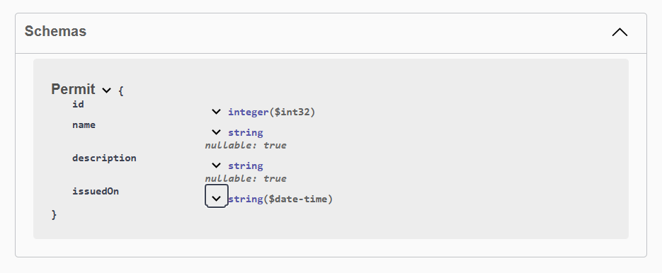
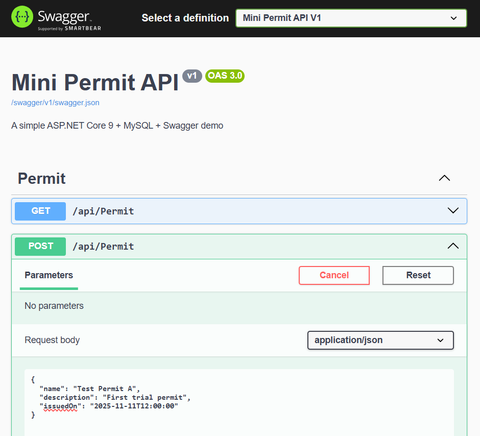
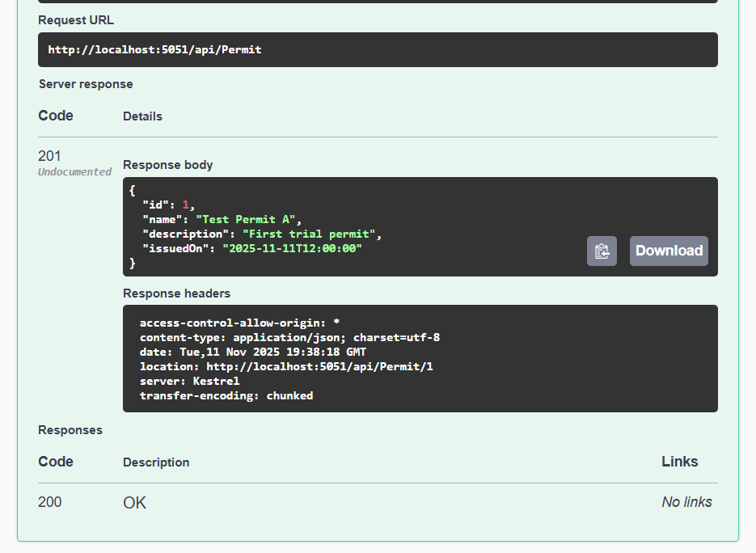
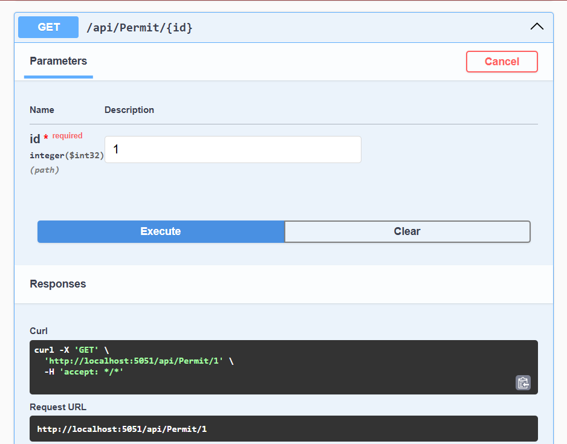
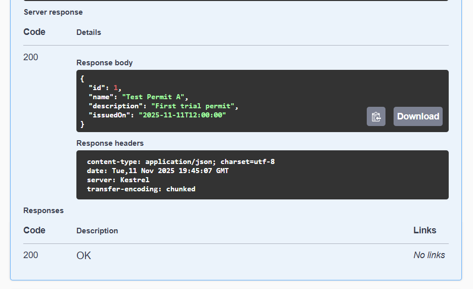
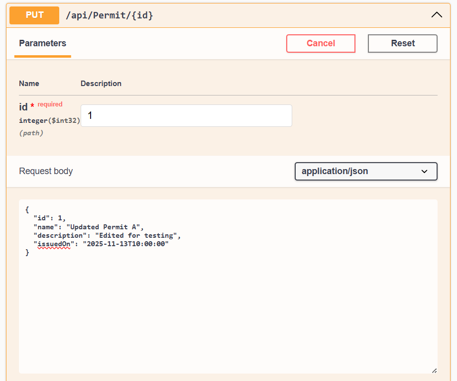
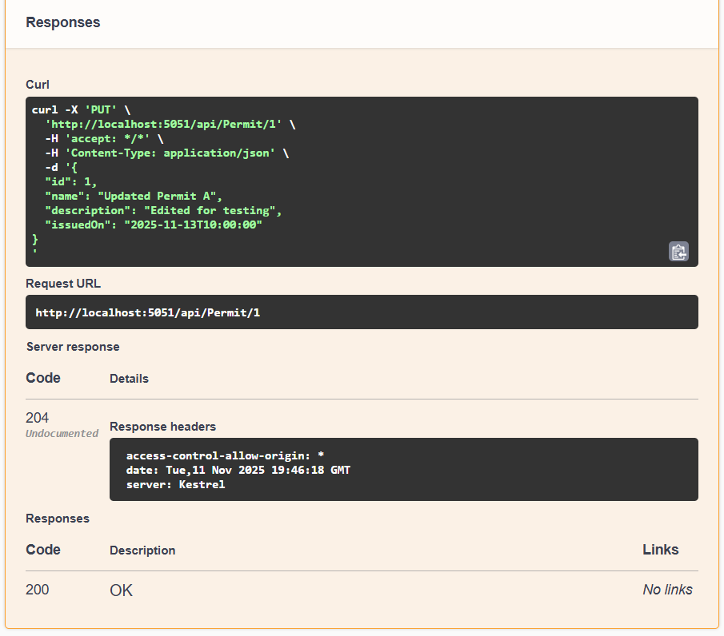
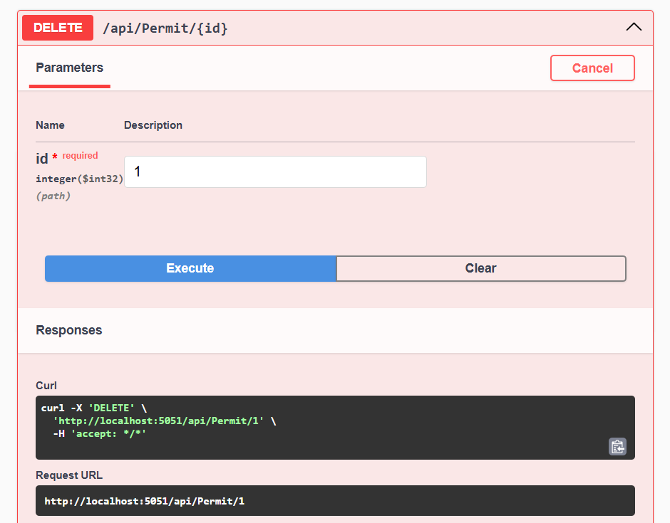
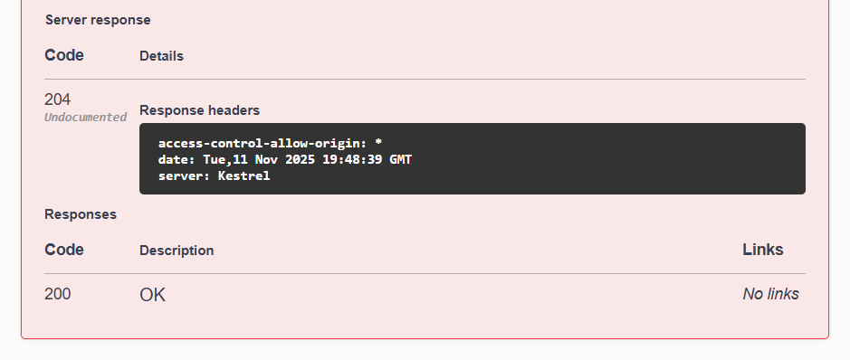

# Mini Permit Management API (Prototype)

**Practice project built to learn .NET, MySQL, and Swagger before starting IOCL internship.**

* This project is a **Mini Permit Management System** built using **ASP.NET Core 9**, **Entity Framework Core**, **MySQL**, and **Swagger UI**.  
* It serves as a **prototype** for understanding backend API development, database integration, and API documentation before building the full-scale system during internship work.

---

## Database Schema
 **Schema:** `Prototype` (MySQL) 
* Entity: `Permits`  
* Columns → `Id`, `Name`, `Description`, `IssuedOn`



---

## Features Implemented
| Feature | Description |
|----------|--------------|
| **Create (POST)** | Add a new permit entry to the database |
| **Read (GET)** | Fetch all permits or a specific one by ID |
| **Update (PUT)** | Modify an existing permit record |
| **Delete (DELETE)** | Remove a permit record |
| **Swagger UI** | Interactive REST API documentation and testing |
| **Entity Framework Core** | ORM for seamless DB integration |
| **CORS Handling** | Enabled for browser testing in Swagger |

---

## Learning Goals
- Understand end-to-end web application flow (client → server → DB → client)
- Practice REST API design and CRUD implementation
- Integrate Swagger for auto-generated API documentation
- Configure MySQL in .NET backend using EF Core
- Learn debugging, migrations, and deployment workflow

---

## Tech Stack
| Layer | Technology |
|--------|-------------|
| **Backend Framework** | ASP.NET Core 9 (Web API) |
| **Programming Language** | C# |
| **Database** | MySQL (Schema: `Prototype`) |
| **ORM** | Entity Framework Core |
| **API Testing** | Swagger UI |
| **IDE** | Visual Studio 2022 / VS Code |
| **Package Manager** | NuGet |
| **Runtime** | .NET SDK 9.0 |

---


## Setup Instructions

### **1. Clone the repository**
```bash
git clone https://github.com/lishaangral/MiniPermit.git
cd mini-permit
````

### **2. Configure the database**

Open `appsettings.json` and set your MySQL credentials:

```json
"ConnectionStrings": {
  "DefaultConnection": "server=localhost;port=3306;database=Prototype;user=root;password=YourPassword;"
}
```

### **3. Run migrations**

```bash
dotnet ef migrations add InitialCreate
dotnet ef database update
```

### **4. Start the API**

```bash
dotnet run
```

Swagger will open at:
 `http://localhost:5051/swagger`

---

## CRUD Operations Demonstration

### **1. Create (POST)**

**Endpoint:** `/api/Permit`\
**Function:** Adds a new permit to the `Prototype` database.

| Request                          | Response                           |
| ---------------------------------------------- | ---------------------------------------------- |
|  |  |

---

### **2. Read (GET)**

**Endpoints:**

* `/api/Permit` → Fetch all permits
* `/api/Permit/{id}` → Fetch specific permit by ID

| Request                        | Response                        |
| -------------------------------------------- | -------------------------------------------- |
|  |  |

---

### **3. Update (PUT)**

**Endpoint:** `/api/Permit/{id}`\
**Function:** Edits an existing record’s name, description, or issue date.

| Request                       | Response                         |
| -------------------------------------------- | -------------------------------------------- |
|  |  |

---

###  **4. Delete (DELETE)**

**Endpoint:** `/api/Permit/{id}`\
**Function:** Deletes a permit record permanently.

| Request                        | Response                |
| -------------------------------------------------- | -------------------------------------------------- |
|  |  |

---

## Summary

This **Mini Permit Management API** demonstrates:

* Full CRUD lifecycle with a relational database.
* REST principles and JSON communication.
* Integration of Swagger UI for testing and documentation.
* Practical groundwork for transitioning from **PHP to .NET backend** for the IOCL Permit system.
